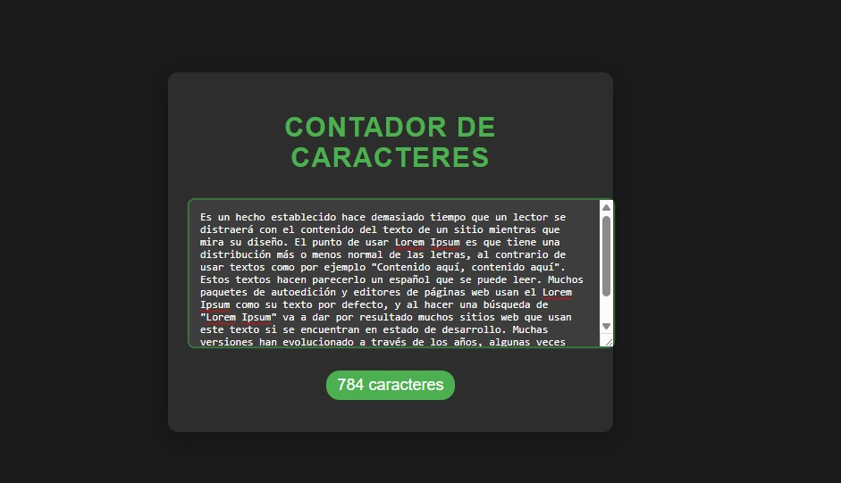

# Contador de Caracteres

Aplicación web interactiva que muestra en tiempo real la cantidad de caracteres ingresados en un cuadro de texto, con efectos visuales dinámicos y alertas de longitud.

## Características principales

✅ **Conteo en tiempo real**  
✅ **Animaciones de pulso** al actualizar el conteo  
✅ **Colores de estado**:  
   - Verde: Hasta 50 caracteres  
   - Naranja: Entre 51-100 caracteres  
   - Rojo: Más de 100 caracteres  
✅ **Diseño responsive** adaptable a móviles  
✅ **Interfaz minimalista** con efectos de sombras y transiciones suaves
